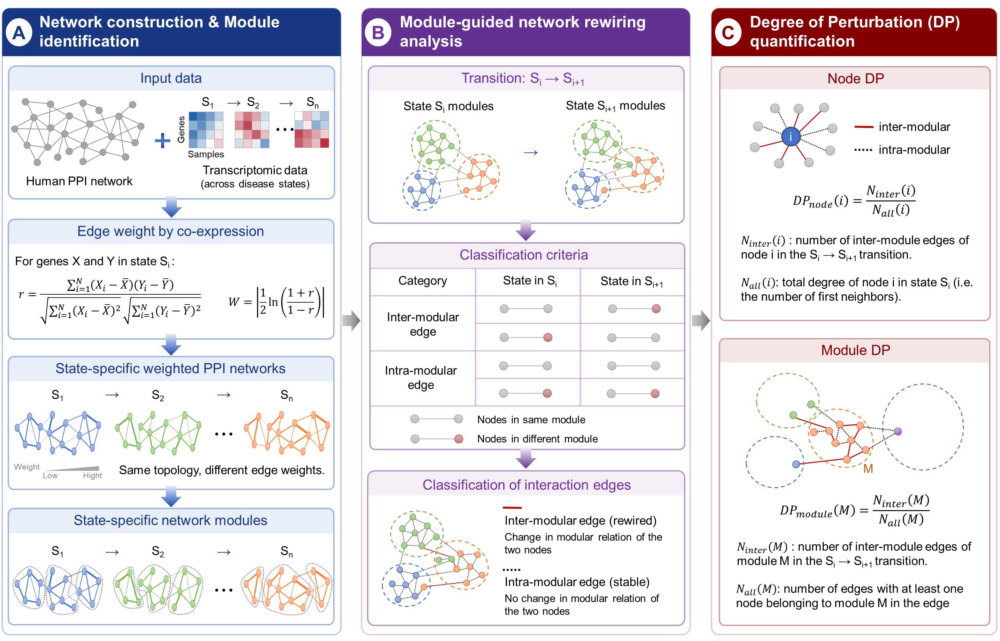

# DPA
Dynamic Perturbation Analysis (DPA) is an R framework for identifying dynamic network perturbations during disease progression using state-specific weighted protein-protein interaction (PPI) networks.

The workflow integrates:

- Construction of state-specific weighted PPI networks and identification of network modules
- Module rewiring analysis
- Degree of Perturbation (DP) score calculation

---
## Workflow


---

## Installation

Clone this repository

```r
git clone https://github.com/yourname/DPA.git
```

Install required packages

```r
install.packages(c(
    "igraph",
    "progress"
))
```

---

## Input

### Expression matrix

Rows

- genes

Columns

- samples

Example

| Gene | Sample1 | Sample2 | ... |
|------|----------|----------|-----|

---

### Phenotype table

| sampleID | phase |
|----------|-------|
| S1 | N |
| S2 | N |
| S3 | I |
| ... | ... |

---

### STRING network

Required columns

```
protein1
protein2
combined_score
```

---

## Usage

```r
source("R/global.R")
source("R/load_string.R")
source("R/build_state_network.R")
source("R/detect_modules.R")
source("R/module_rewiring.R")
source("R/calculate_DP.R")
```

### Step 1

Construct state-specific weighted PPI networks

```r
network <- build_state_network(
    expr,
    phenotype,
    ppi
)
```

Detect modules

```r
module_res <- detect_modules(network)
```

Outputs

- Gene-module assignment
- Module conservation scores

---

### Step 2

Identify module rewiring

```r
rewired_res <- identify_module_rewiring(
    gene_module,
    network
)
```

---

### Step 3

Calculate DP

Node DP

```r
nodeDP <- calculate_node_DP(
    rewired_df,
    gene_module
)
```

Module DP

```r
moduleDP <- calculate_module_DP(
    rewired_df,
    gene_module
)
```

---

## Output

| File | Description |
|------|-------------|
| State-specific_weighted_PPI_network.csv | Weighted network |
| Gene_module_table.csv | Module assignment |
| Module_change_&_conservation_score.csv | Module conservation |
| Module_rewiring_table.csv | Rewired edges |
| DP_node.csv | Node DP scores |
| DP_module.csv | Module DP scores |

---

## Citation

If you use DPA in your work, please cite our manuscript (coming soon).

```
